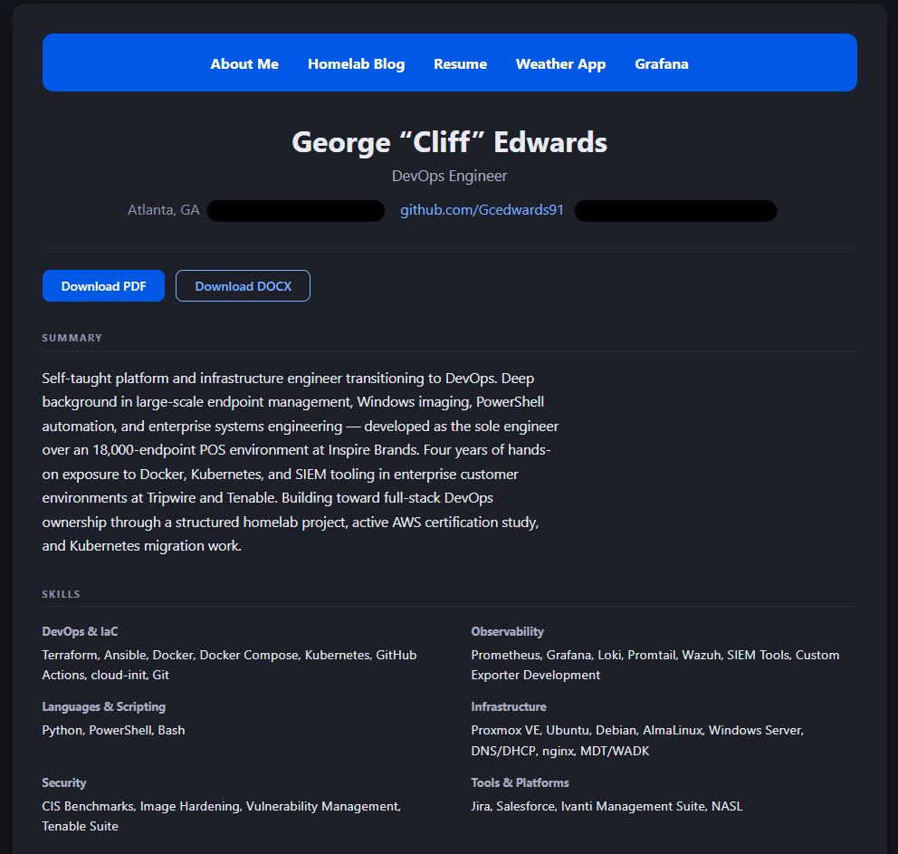
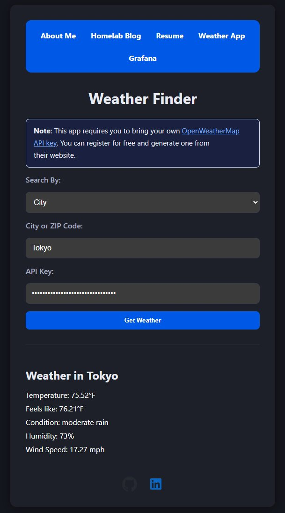
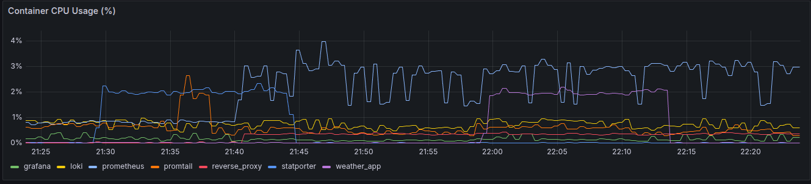

# Homelab Infrastructure Project

A structured homelab project built to apply modern DevOps and SRE practices in a self-managed environment. This is not a tutorial stack — every component was configured, debugged, and wired together from scratch.

> **Live demo:** `http://your-domain.com` _(coming soon — AWS deployment in progress)_

---

## What This Is

A full-stack observability and application platform running on a single Proxmox host, built across four phases:

- **Infrastructure as Code** — VMs provisioned with Terraform, configured with Ansible
- **Containerized application stack** — Flask portfolio app, custom Prometheus exporter, Grafana, Loki, Promtail, Alertmanager, nginx reverse proxy
- **Custom observability tooling** — a hand-built Prometheus exporter (`statporter`) that collects per-container CPU, memory, network, and disk I/O metrics via the Docker socket
- **CI/CD pipeline** — GitHub Actions building and publishing Docker images to DockerHub on every push to master
- **Portfolio web layer** — About Me, Blog, Resume, and Weather App pages built with a structured design system (Impeccable), including dark mode, WCAG AA accessibility, and a responsive layout
- **Observability Playground** — an interactive demo page where recruiters can stop and start a dummy container, spike its CPU, and watch real Prometheus alerts fire and resolve in real time

---

## Architecture

```
                        ┌─────────────────────────────────────────┐
                        │             Docker Host                  │
                        │                                          │
  Browser ──── :80 ──▶  │  nginx (reverse proxy)                   │
                        │     │                                    │
                        │     ├──▶ weather-app     :5000           │
                        │     ├──▶ grafana          :3000          │
                        │     └──▶ prometheus       :9090          │
                        │                                          │
                        │  prometheus ◀── statporter   :9800       │
                        │  prometheus ◀── weather-app              │
                        │  prometheus ◀── grafana                  │
                        │  prometheus ◀── loki                     │
                        │  prometheus ──▶ alertmanager  :9093      │
                        │                                          │
                        │  weather-app ──▶ docker.sock (rw)        │
                        │  weather-app ──▶ demo-container  :8080   │
                        │                                          │
                        │  loki ◀── promtail                       │
                        │  promtail ── /var/run/docker.sock        │
                        └─────────────────────────────────────────┘
```

---

## Stack

| Service        | Image                         | Purpose                                               |
| -------------- | ----------------------------- | ----------------------------------------------------- |
| nginx          | `nginx:1.27-alpine`           | Reverse proxy, sub-path routing                       |
| weather-app    | `burningstar4/weather-app`    | Flask portfolio app — UI, API, and playground routes  |
| demo-container | `burningstar4/demo-container` | Disposable dummy container — playground toggle target |
| prometheus     | `prom/prometheus:v3.3.1`      | Metrics collection, alerting, and storage             |
| alertmanager   | `prom/alertmanager:v0.28.1`   | Alert routing (null receiver — alerts visible in UI)  |
| grafana        | `grafana/grafana:11.6.1`      | Metrics and log visualization                         |
| loki           | `grafana/loki:3.5.0`          | Log aggregation                                       |
| promtail       | `grafana/promtail:3.5.0`      | Log shipping — Docker socket autodiscovery            |
| statporter     | `burningstar4/statporter`     | Custom Prometheus exporter for Docker stats           |

Every container is configured with explicit CPU and memory limits, reservations, healthchecks, and log rotation (`max-size: 50m`, `max-file: 5`). Grafana exposes anonymous read-only access by default — admin credentials are set via `.env`.

---

## Statporter

`statporter` is a custom-built Prometheus exporter written in Python/Flask, served by Gunicorn. It was built to work around cgroups v2 compatibility issues with existing exporters at the time.

It collects the following metrics per container by querying the Docker socket directly:

| Metric                                   | Description                          |
| ---------------------------------------- | ------------------------------------ |
| `container_cpu_percent`                  | CPU usage %                          |
| `container_memory_usage_bytes`           | Memory usage in bytes                |
| `container_memory_percent`               | Memory usage %                       |
| `container_network_receive_bytes_total`  | Cumulative network bytes received    |
| `container_network_transmit_bytes_total` | Cumulative network bytes transmitted |
| `container_blkio_read_bytes_total`       | Cumulative disk I/O bytes read       |
| `container_blkio_write_bytes_total`      | Cumulative disk I/O bytes written    |

---

## Observability Playground

The playground (`/playground`) is a passphrase-protected interactive demo that makes the full alerting loop tangible:

- **Stop/start `demo-container`** — triggers the `DemoContainerDown` alert in Prometheus within 90 seconds
- **Spike CPU for 60 seconds** — triggers the `DemoContainerHighCPU` alert within 60 seconds
- **Live alert feed** — polls `/prometheus/api/v1/alerts` every 10 seconds and displays firing alerts in real time

`demo-container` is a purpose-built disposable Flask app. Stopping it during a demo does not affect any real service.

The passphrase rotates every 4 hours, derived via HMAC-SHA256 from `PLAYGROUND_SECRET`. Cliff retrieves the current passphrase from a protected admin endpoint before sharing the playground link with a recruiter.

---

## Screenshots

### Portfolio and Resume Page



### Weather App



### Grafana — Container Metrics Dashboard



---

## Prerequisites

- Docker and Docker Compose
- An [OpenWeatherMap API key](https://openweathermap.org/api) (free tier works)

---

## Running Locally

```bash
# Clone the repo
git clone https://github.com/Gcedwards91/homelab-infra.git
cd homelab-infra/weather-app/docker-final

# Create your environment file
cp .env.example .env
# Edit .env and set at minimum:
#   GRAFANA_ADMIN_USER, GRAFANA_ADMIN_PASSWORD
#   FLASK_SECRET_KEY  (generate: python3 -c "import secrets; print(secrets.token_hex(32))")
#   PLAYGROUND_SECRET (generate: python3 -c "import secrets; print(secrets.token_hex(32))")
#   PLAYGROUND_ADMIN_KEY (generate: python3 -c "import secrets; print(secrets.token_urlsafe(32))")

# Pull and start the stack
docker compose pull
docker compose up -d

# Verify all services are healthy
docker compose ps
```

Once running:

| Service    | URL                         |
| ---------- | --------------------------- |
| Portfolio  | http://localhost            |
| Playground | http://localhost/playground |
| Grafana    | http://localhost/grafana    |
| Prometheus | http://localhost/prometheus |

Grafana is accessible without login in read-only mode. To make changes, log in with the credentials from your `.env` file.

To get the current playground passphrase:

```bash
curl -s -H "Authorization: Bearer $PLAYGROUND_ADMIN_KEY" \
  http://localhost/playground/passphrase | python3 -m json.tool
```

---

## Project Structure

```
homelab-infra/
├── terraform/               # VM provisioning (Proxmox via Telmate provider)
├── lamp-ansible/            # Ansible playbooks — LAMP stack
├── scripts/                 # Bash scripts — VM template preparation
├── weather-app/
│   ├── demo-container/      # Disposable Flask app — playground toggle target
│   ├── docker-src/          # Flask app source — built into burningstar4/weather-app
│   │   ├── main.py          # Flask routes and blueprint registration
│   │   ├── playground.py    # Playground blueprint — auth, toggle, stress, alerts
│   │   ├── templates/       # Jinja2 HTML templates (all pages)
│   │   └── static/          # CSS, favicon, icons
│   └── docker-final/        # Production Docker Compose stack
│       ├── docker-compose.yml
│       ├── .env.example
│       ├── nginx/           # Reverse proxy config
│       ├── prometheus/      # Scrape config and alert rules
│       ├── alertmanager/    # Alert routing config
│       ├── grafana/         # Provisioned dashboards and datasources
│       ├── loki/            # Log retention config
│       ├── promtail/        # Log shipping config
│       └── logrotate/       # Host-level log rotation config (copy to /etc/logrotate.d/)
├── CLAUDE.md                # Persistent context for Claude Code sessions
├── PRODUCT.md               # Brand and design strategy
├── DESIGN.md                # Visual design system tokens and component specs
├── PLAYGROUND_PR.md         # Full implementation spec for the playground feature
└── TESTING_CHECKLIST.md     # End-to-end testing checklist
```

---

## CI/CD

GitHub Actions handles automated builds and publishes on every push to `master`:

| Workflow                          | Trigger path                                                   | What it does                                                        |
| --------------------------------- | -------------------------------------------------------------- | ------------------------------------------------------------------- |
| `docker-build-weather-app.yml`    | `weather-app/docker-src/**`                                    | Builds and pushes `burningstar4/weather-app:latest`                 |
| `docker-build-statporter.yml`     | `weather-app/docker-final/statporter/**`                       | Builds and pushes `burningstar4/statporter:latest`                  |
| `docker-build-demo-container.yml` | `weather-app/demo-container/**`                                | Builds and pushes `burningstar4/demo-container:latest`              |
| `format_and_lint-test.yml`        | all pushes                                                     | Black, Flake8, Prettier, Hadolint, yamllint                         |
| `security_lint.yml`               | all pushes                                                     | Bandit, Trivy, ShellCheck, Gitleaks                                 |
| `integration-tests.yml`           | `weather-app/docker-final/**`, `weather-app/demo-container/**` | Spins up full stack, runs pytest, opens structured issue on failure |
| `targeted-test.yml`               | manual (`workflow_dispatch`)                                   | Runs tests for one service, auto-closes the linked issue on pass    |

---

## Local Build

```bash
make build-all    # builds weather-app, statporter, and demo-container
make push-all     # pushes all three to DockerHub
make build-demo   # builds demo-container only
```

---

## What's Next

- [x] CI/CD pipeline via GitHub Actions
- [x] Observability Playground — interactive alert demo for recruiters
- [ ] Migrate stack to Kubernetes (manifests in progress)
- [ ] Deploy to AWS (ECS or EKS) with Terraform
- [ ] TLS via ACM + Route53 custom domain
- [ ] Secrets management via AWS Secrets Manager

---

## Build Journal

The full phase-by-phase build notes, lessons learned, and troubleshooting log are documented in the [Wiki](https://github.com/Gcedwards91/homelab-infra/wiki/Journey-&-Lessons-Learned).

---

## Author

**George "Cliff" Edwards**
[GitHub](https://github.com/Gcedwards91) · [LinkedIn](https://www.linkedin.com/in/gcedwards91/)
